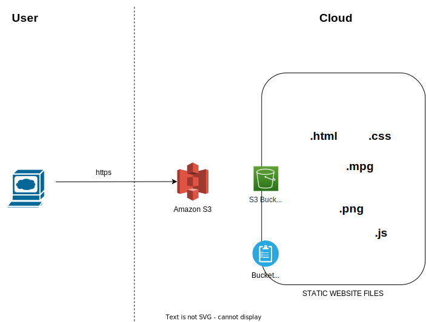

# AWS Cloud Static Website

A module creating a S3 bucket to serve static web content. The content that is served is copied from the [static directory](../static/).

<!-- BEGINNING OF PRE-COMMIT-TERRAFORM DOCS HOOK -->
## Requirements

| Name | Version |
|------|---------|
|  [terraform](#requirement\_terraform) | >= 1.3 |
|  [aws](#requirement\_aws) | 4.66.0 |
|  [random](#requirement\_random) | 3.5.1 |

## Modules

| Name | Source | Version |
|------|--------|---------|
|  [object](#module\_object) | terraform-aws-modules/s3-bucket/aws//modules/object | 3.10.1 |
|  [s3\_bucket](#module\_s3\_bucket) | terraform-aws-modules/s3-bucket/aws | 3.10.1 |

## Resources

| Name | Type |
|------|------|
| [random_string.bucket_name_suffix](https://registry.terraform.io/providers/hashicorp/random/3.5.1/docs/resources/string) | resource |
| [aws_iam_policy_document.anonymous_bucket_policy](https://registry.terraform.io/providers/hashicorp/aws/4.66.0/docs/data-sources/iam_policy_document) | data source |

## Inputs

| Name | Description | Type | Default | Required |
|------|-------------|------|---------|:--------:|
|  [access\_key](#input\_access\_key) | The access key for API operations. You can retrieve this from the 'Security & Credentials' section of the AWS console. | `string` | n/a | yes |
|  [prefix](#input\_prefix) | Prefix added to all resources that will be created | `string` | `"static-web-demo"` | no |
|  [region](#input\_region) | AWS region where resources will be created | `string` | `"eu-west-1"` | no |
|  [secret\_key](#input\_secret\_key) | The secret key for API operations. You can retrieve this from the 'Security & Credentials' section of the AWS console. | `string` | n/a | yes |

## Outputs

| Name | Description |
|------|-------------|
|  [url](#output\_url) | url |
<!-- END OF PRE-COMMIT-TERRAFORM DOCS HOOK -->
<!-- BEGIN CONTRIBUTING HOOK -->

<!-- Leave this section as is so that your module has a link to local development environment set up steps for contributors to follow -->
## Contributing

You can report issues and request features for this module in GitHub issues in the module repo. See [Report an issue or request a feature](https://github.com/terraform-ibm-modules/.github/blob/main/.github/SUPPORT.md).

To set up your local development environment, see [Local development setup](https://terraform-ibm-modules.github.io/documentation/#/local-dev-setup) in the project documentation.
<!-- Source for this readme file: https://github.com/terraform-ibm-modules/common-dev-assets/tree/main/module-assets/ci/module-template-automation -->
<!-- END CONTRIBUTING HOOK -->
